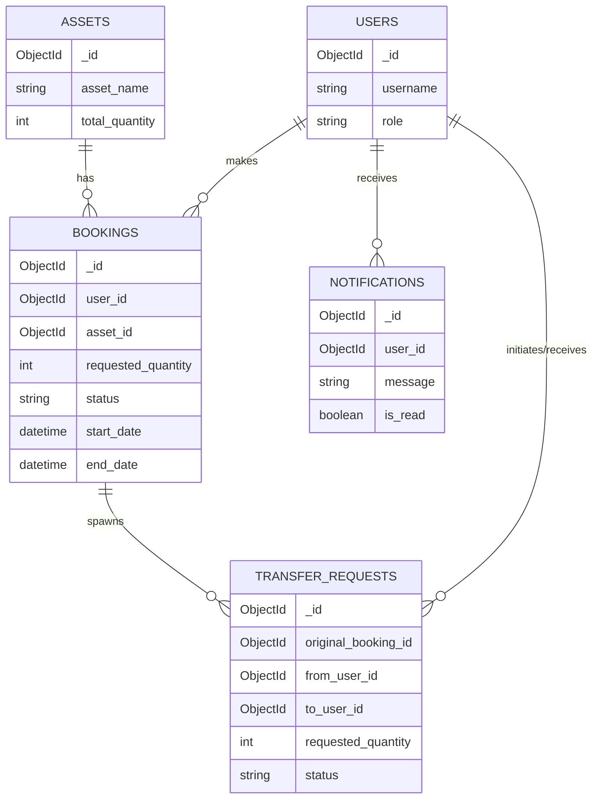

# Design Document: Smart Asset Management Platform

## 1. Problem Understanding
The Cultural Council of IIT Roorkee and similar organizations frequently manage a large pool of shared resources (e.g., DSLRs, audio systems, costumes). These resources are shared across multiple events and teams. Without a centralized system, the allocation process relies on fragmented communication (spreadsheets, manual registers), leading to resource underutilization, scheduling conflicts, and lost accountability. 

The goal is to build a full-stack, scalable platform that digitizes this workflow. It must support inventory management, dynamic availability checking to prevent double-booking, robust admin approval pipelines, and precise tracking of asset issuance and returns. Furthermore, advanced scenarios such as Peer-to-Peer (P2P) transfers must be supported to handle dynamic, on-the-ground resource reallocation while preserving strict auditability.

## 2. System Architecture
The application follows a standard modern 3-tier architecture:
- **Client Tier (Frontend)**: A React Single Page Application (SPA) built with Vite and TailwindCSS. It provides role-based interfaces (Admin Dashboard vs User Portal) and communicates with the backend via REST APIs using Axios.
- **Application Tier (Backend)**: A Python FastAPI server handling business logic, authentication, request validation, and dynamic inventory computations. FastAPI was chosen for its high performance, native asynchronous support, and automatic OpenAPI documentation.
- **Data Tier (Database)**: A MongoDB NoSQL database, accessed asynchronously via the Motor driver. MongoDB provides the flexible schema design necessary to handle complex, deeply nested JSON documents like the chronological audit timeline and P2P transfer lineage.

## 3. Database Schema
The database (`smart_asset_management`) consists of the following primary collections:

### Users
- `_id`: ObjectId
- `username`: String
- `email`: String (Unique)
- `password_hash`: String
- `role`: String (Enum: 'admin', 'user')

### Assets
- `_id`: ObjectId
- `asset_name`: String
- `category`: String
- `description`: String
- `total_quantity`: Integer
- `status`: String (Enum: 'Active', 'Maintenance', 'Retired')
- `created_at` / `updated_at`: DateTime

### Bookings
- `_id`: ObjectId
- `user_id`: ObjectId (Ref: Users)
- `asset_id`: ObjectId (Ref: Assets)
- `requested_quantity`: Integer
- `approved_quantity`: Integer
- `start_date` / `end_date`: DateTime
- `status`: String (Enum: 'Pending', 'Approved', 'Rejected', 'Issued', 'Returned', 'Overdue')
- `reason`: String
- `created_at` / `updated_at` / `issued_at` / `returned_at`: DateTime
- `past_users`: Array of ObjectIds (Ref: Users, tracks P2P lineage)
- `is_p2p_child`: Boolean

### Transfer Requests (P2P)
- `_id`: ObjectId
- `original_booking_id`: ObjectId (Ref: Bookings)
- `asset_id`: ObjectId (Ref: Assets)
- `from_user_id`: ObjectId (Ref: Users)
- `to_user_id`: ObjectId (Ref: Users)
- `requested_quantity`: Integer
- `approved_quantity`: Integer
- `status`: String (Enum: 'Pending User Approval', 'Pending Admin Approval', 'Completed', 'Rejected')
- `new_booking_id`: ObjectId (Ref: Bookings, created upon completion)

### Notifications
- `_id`: ObjectId
- `user_id`: ObjectId (Ref: Users)
- `title`: String
- `message`: String
- `is_read`: Boolean
- `type`: String

### System Events (Audit Log)
- `_id`: ObjectId
- `event_type`: String (e.g., 'ASSET_CREATED', 'ASSET_DELETED')
- `description`: String
- `user_id`: ObjectId
- `timestamp`: DateTime

## 4. Entity Relationship Diagram (ERD)

## 5. API Overview

### Authentication `/api/auth`
- `POST /register`: Register a new user
- `POST /login`: Authenticate and set HttpOnly JWT cookie
- `POST /logout`: Clear session cookie
- `GET /me`: Get current user details

### Assets `/api/assets`
- `GET /`: List all active assets (with optional text search)
- `POST /`: Create a new asset (Admin)
- `PUT /{id}`: Update asset details (Admin)
- `DELETE /{id}`: Permanently delete an asset (Admin)

### Bookings `/api/bookings`
- `POST /`: Submit a new booking request
- `GET /my-bookings`: Fetch user's booking history
- `GET /`: Fetch global booking history (Admin)
- `PUT /{id}/approve`: Admin approves a booking (supports partial quantity)
- `PUT /{id}/reject`: Admin rejects a booking
- `PUT /{id}/issue`: Admin marks asset as physically issued
- `PUT /{id}/return`: Admin marks asset as returned to inventory

### Transfers (P2P) `/api/transfers`
- `POST /`: Initiate a P2P transfer request
- `PUT /{id}/user-respond`: Target user accepts/rejects the request
- `PUT /{id}/admin-respond`: Admin finalizes the transfer, mutating booking lineage

### Notifications & Audit `/api/notifications`, `/api/audit`
- `GET /notifications`: Fetch unread notifications
- `PUT /notifications/mark-read`: Mark all as read
- `GET /audit/system-events`: Fetch global system events for timeline

## 6. Design Decisions

1. **Dynamic Availability Computation**: Instead of maintaining a static `available_quantity` field on the Asset model, inventory is calculated dynamically on-the-fly. The system fetches all active bookings overlapping with the requested date range and computes the peak usage using a sweeping line algorithm. This inherently prevents double-booking without complex, error-prone database triggers.
2. **Chronological Audit Timeline**: To ensure maximum accountability, the Master Audit Log dynamically parses and sorts all timestamps (Requests, Approvals, Issues, Returns, and Transfers) into a flat chronological array. It calculates a running quantity tracker to guarantee that the UI strictly represents the user's exact held quantity at any given minute in history.
3. **P2P Transfer Lineage**: When a partial P2P transfer is approved by the Admin, the system splits the original booking into two distinct bookings (one for the original owner, one for the new owner) while saving the lineage (`past_users`). This keeps the database normalized and allows the new owner to return the asset independently.
4. **JWT in HttpOnly Cookies**: To mitigate XSS vulnerabilities, the authentication tokens are stored in secure, HttpOnly cookies rather than localStorage.
5. **Role-Based Fast Tracking**: Admins can natively fast-track operations (e.g., booking an asset directly issues it if the start date is today) to reduce unnecessary clicks for trusted operators.
